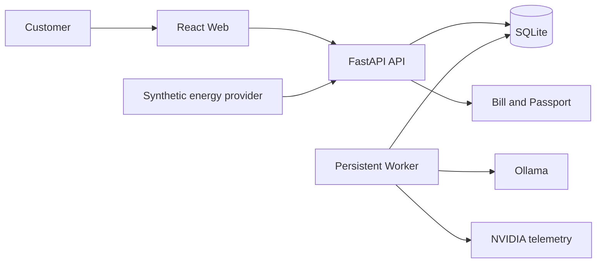

# Architecture

## Context

GreenFlex is operated by a compute provider and consumed by a customer. The user selects a model tier or exact model, previews one prompt, uploads a structured batch, accepts a simulated quote, and receives results plus an evidence record. Manufacturer billing and VPP aggregation are later bounded contexts that consume the same order and workload contracts.

## Container boundaries

| Container | Responsibility | Must not do |
|---|---|---|
| Web | Forms, quote comparison, order status, result download | Hold secrets or calculate authoritative prices |
| API | Validate requests, persist state, quote, schedule, expose OpenAPI | Execute arbitrary commands or log prompts |
| Worker | Lease queued work, call inference adapter, capture telemetry | Accept user-controlled executable paths |
| Infrastructure adapters | Ollama, NVIDIA, SQLite, synthetic signals | Leak provider details into the domain layer |

## Domain modules

- `catalog`: enabled models, capability tiers, immutable model digests, simulated rate cards.
- `preview`: single immediate inference with measured telemetry.
- `quote`: deterministic price estimates, rebate line items, and expiry.
- `orders`: upload validation, state machine, cancellation, content purge, result artifacts.
- `scheduling`: immediate FIFO and flexible fifteen-minute slot selection.
- `execution`: persistent leases, retry-once policy, item-level outcomes.
- `accounting`: actual token settlement and quote variance.
- `passport`: provenance-only audit output with no prompt or response text.

## Stable ports

`InferenceProvider`, `TelemetryProvider`, `EnergySignalProvider`, `SchedulingPolicy`, `PricingPolicy`, `BillingPolicy`, and `PassportIssuer` are application-facing protocols. Future PostgreSQL, cloud inference, manufacturer billing, and VPP adapters must implement these contracts rather than bypassing them.

## State and consistency

- Database timestamps are UTC; API timestamps include an offset; the UI defaults to Asia/Shanghai.
- Money, energy, and carbon are stored as integer micro-units.
- A quote locks model, rates, and flexible rebate for fifteen minutes.
- A worker lease prevents duplicate execution and is recoverable after expiry.
- Raw telemetry is an optional compressed artifact; its SHA-256 is stored with the execution.
- Order content and result content may be purged while aggregate billing and audit hashes remain.

## Deployment

The unauthenticated MVP binds to `127.0.0.1` only. Exposing it on a network requires an authentication and tenant-isolation release, which is explicitly outside v0.1.0.

