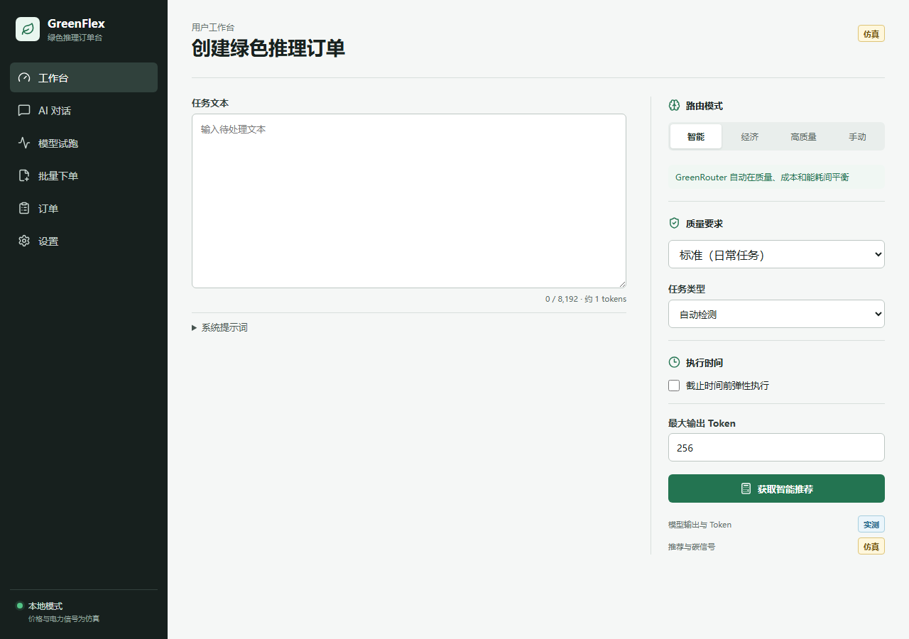
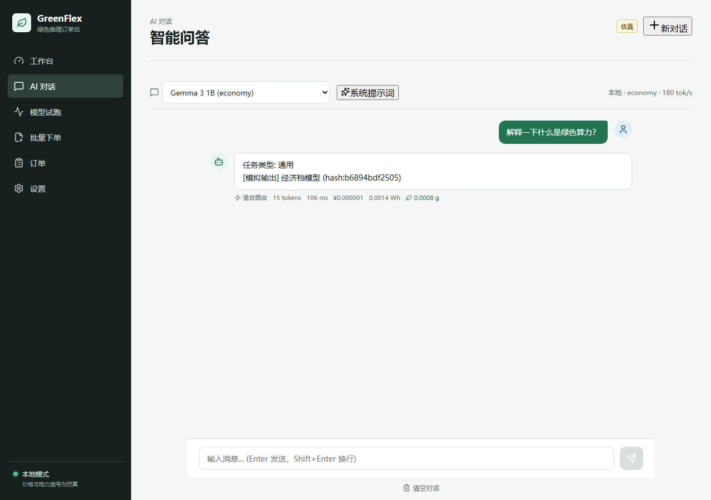
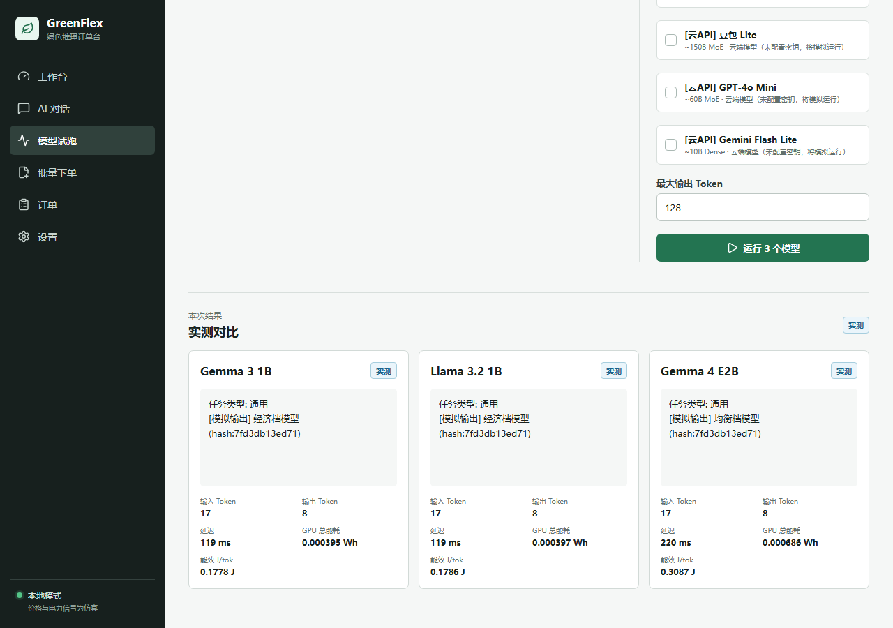
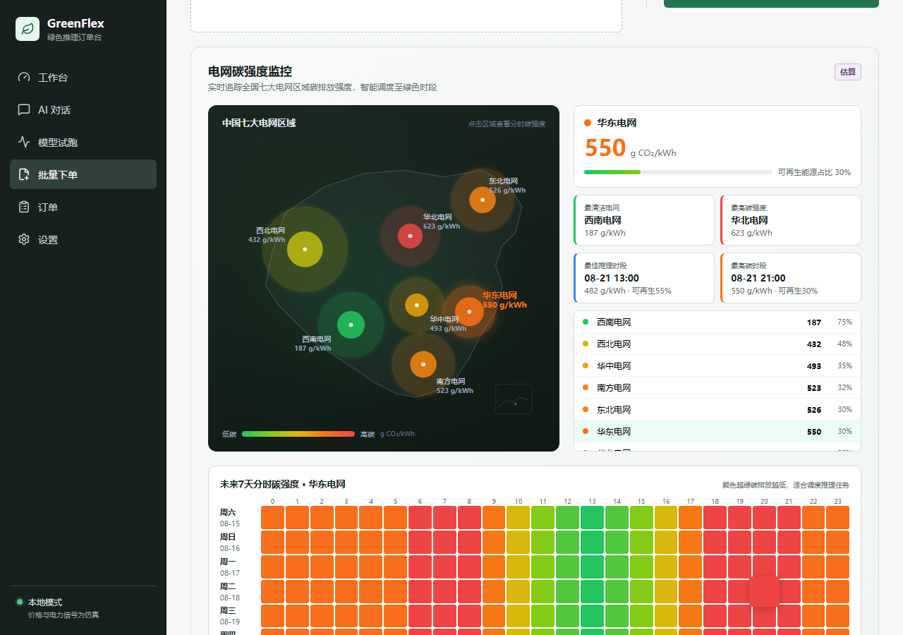
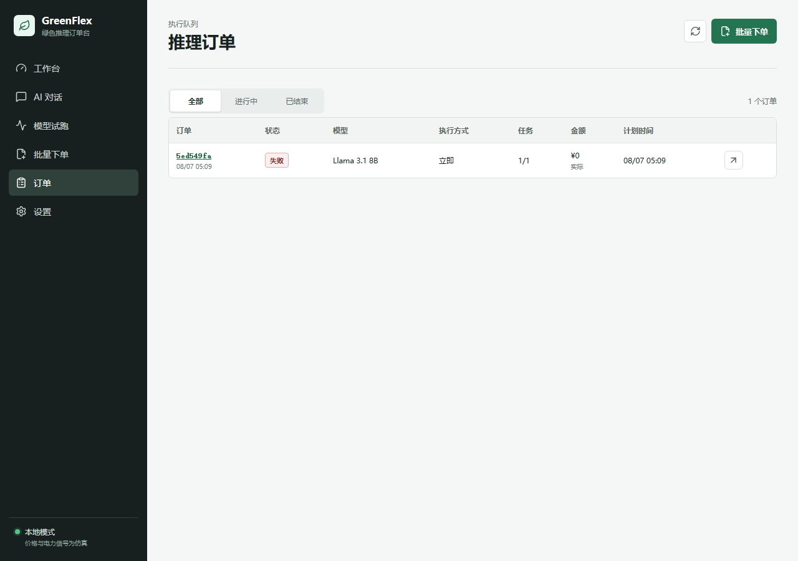
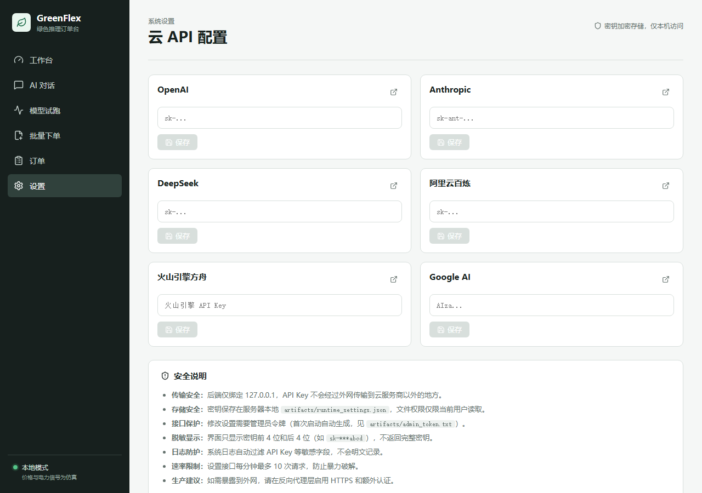

# GreenFlex 绿色 AI 推理路由平台

> 帮你在 **成本、速度、质量、碳排放** 之间找到最优解的 AI 模型路由平台。
> 内置 35 个模型（13 本地 + 20 云端），开箱即用，无需 GPU、无需安装 Ollama、无需 API Key。

[English](./README.en.md) | 中文

---

## 目录

- [这是什么](#这是什么)
- [核心功能](#核心功能)
- [功能截图](#功能截图)
- [快速开始](#快速开始)
- [使用教程](#使用教程)
- [模型目录](#模型目录)
- [配置说明](#配置说明)
- [云 API 接入](#云-api-接入)
- [碳信号与绿色调度](#碳信号与绿色调度)
- [API 文档](#api-文档)
- [架构设计](#架构设计)
- [数据来源与可信度](#数据来源与可信度)
- [安全说明](#安全说明)
- [常见问题](#常见问题)
- [开发与测试](#开发与测试)
- [许可证](#许可证)

---

## 这是什么

GreenFlex 是一个**绿色 AI 推理路由平台**：你用自然语言描述任务，它自动分析任务类型和复杂度，从 35 个模型中推荐最合适的一个——在满足质量要求的前提下，帮你省钱、省电、减碳。

### 解决什么问题

| 痛点 | GreenFlex 的方案 |
|------|-----------------|
| 模型太多不知道选哪个 | 输入任务描述，自动推荐最优档位和模型 |
| 小模型便宜但怕质量不行 | 7 种任务类型 × 3 级复杂度的风险矩阵，质量不够自动升级 |
| 大模型好用但太贵 | 智能模式在质量达标时优先选便宜模型，最高省 90% |
| 不知道碳排放有多少 | 每次推理显示能耗、碳排（克）、生活化等效对比 |
| 想调用云端 API 但对接麻烦 | 6 家厂商统一接口，设置页填入 Key 即可使用 |
| 批量任务想省钱又怕超时 | 支持弹性调度，结合电网碳信号选择低碳时段 |

### 设计理念

- **开箱即用**：默认模拟推理模式，零依赖启动，无需 GPU/Ollama/API Key
- **数据可溯源**：每个模型的能耗、价格数据都标注官方来源，不编造数字
- **安全优先**：API Key 只存在服务端，不记录用户输入内容，Passport 只存哈希
- **可扩展**：预留云 API、外部 Agent（GreenConcierge）、强化学习路由器接口

---

## 核心功能

### 1. 智能工作台

输入任务描述（支持模糊自然语言），系统自动：
- 识别 **7 种任务类型**：分类、抽取、摘要、生成、分析、代码、翻译
- 判断 **3 级复杂度**：简单 / 中等 / 复杂（基于文本长度、批量数量、输出长度）
- 推荐 **4 个档位**：经济 / 均衡 / 高质量 / 旗舰
- 给出价格、能耗、碳排、延迟估算和 3 个备选模型

四种模式可选：
- **智能推荐**：自动平衡质量与成本
- **经济模式**：优先最低价，适合批量简单任务
- **高质量模式**：优先质量，适合重要任务
- **手动选择**：自己指定模型

### 2. AI 对话

内置聊天界面，支持：
- 多轮对话
- 自动模型推荐（每次对话前分析任务，选最合适的模型）
- 显示本次对话的模型、价格、能耗、碳排
- 配置云 API Key 后可调用真实大模型，未配置时使用模拟输出

### 3. 模型试跑

在同一任务上同时跑多个模型，横向对比：
- 输出内容
- Token 用量（输入/输出）
- 延迟（秒）
- 能耗（Wh）和碳排（g CO₂）
- 价格（元）

### 4. 碳信号地图

独立页面展示中国 7 大电网区域的实时碳强度：
- 中国地图热力图（颜色越绿越清洁）
- 各区域碳强度排行
- 7 天碳强度日历热力图
- 最清洁/最高碳电网摘要卡片
- 绿色调度建议（何时跑批量任务最低碳）

### 5. 批量下单

- 上传 CSV/JSONL 文件（UTF-8，最大 5MB，500 条）
- 选择立即执行或弹性调度（指定截止时间）
- 自动选择最优模型组合
- 查看逐项结果、账单和能耗
- 支持取消订单和内容清除

### 6. Token Passport

每次推理生成可审计的 Token Passport：
- 输入/输出内容的 SHA-256 哈希（不存原文）
- 使用的模型、Token 数、延迟
- 能耗、碳排及数据来源
- C2PA 1.3 兼容清单（HMAC-SHA256 签名）
- 支持在线验证

### 7. 合规与高级功能

- **EU AI Act 合规报告**：按欧盟 AI 法案第 50/53 条生成透明度和能耗报告
- **强化学习路由器**（可选）：PPO 算法从历史订单学习最优选择策略，默认影子模式
- **外部 Agent 接入**：预留 GreenConcierge Agent 接口，未来可参与任务分析和模型选择

---

## 功能截图

| 工作台 | AI 对话 |
|:---:|:---:|
|  |  |

| 模型试跑 | 碳信号地图 |
|:---:|:---:|
|  |  |

| 批量下单 | 设置 |
|:---:|:---:|
|  |  |

---

## 快速开始

### 环境要求

- Python 3.11+
- Node.js 18+
- Windows / macOS / Linux

> 无需 GPU、无需安装 Ollama、无需 API Key。默认使用模拟推理，安装后立即可用。

### 方式一：Windows 一键启动（推荐）

项目根目录提供了 Windows 一键启动脚本：

```powershell
# 1. 启动后端（首次会自动创建虚拟环境并安装依赖）
cd backend
.\start-windows.bat

# 2. 新开一个终端，启动前端
cd apps\web
npm install
npx vite
```

启动后访问 http://127.0.0.1:5173

### 方式二：手动启动

```powershell
# === 后端 ===
cd backend
python -m venv .venv
.\.venv\Scripts\Activate.ps1     # Windows
# source .venv/bin/activate      # macOS/Linux
pip install -e .

# 初始化数据库
$env:PYTHONPATH="src"            # Windows
# export PYTHONPATH=src          # macOS/Linux
alembic upgrade head

# 启动后端
python -m uvicorn greenflex.api:app --host 127.0.0.1 --port 8000

# === 前端（新开终端）===
cd apps/web
npm install
npx vite
```

打开浏览器访问 http://127.0.0.1:5173 ，API 文档在 http://127.0.0.1:8000/docs

### 验证安装

```powershell
# 健康检查
curl http://127.0.0.1:8000/health

# 获取模型列表
curl http://127.0.0.1:8000/api/v1/models
```

---

## 使用教程

### 示例 1：模糊任务描述 → 智能推荐

用户不需要知道 Token 数和模型名称，直接描述任务：

**输入**：
```
帮我把这篇 3000 字的会议纪要整理成摘要，突出行动项
```

**系统自动分析**：
- 任务类型：摘要（summarization）
- 复杂度：中等（输入较长）
- 推荐档位：均衡（balanced）
- 推荐模型：Qwen2.5 3B（本地）或 GPT-4o（云端）
- 预估价格：¥0.002 / 预估能耗：0.8 Wh / 预估碳排：0.5 g

**为什么不推荐经济档？** 3000 字输入的摘要任务对小模型有质量风险，系统自动升级到均衡档。

### 示例 2：批量分类任务 → 经济模式

**输入**：
```
我有 500 条客服消息，判断每条是投诉、咨询还是建议
```

**系统推荐**：
- 任务类型：分类（classification）
- 复杂度：简单（分类任务小模型即可）
- 推荐档位：经济（economy）
- 推荐模型：Gemma 3 1B 或 GPT-4o Mini
- 500 条总价约 ¥0.05，能耗约 1.2 Wh

### 示例 3：代码生成 → 自动升级

**输入**：
```
用 Python 写一个带重试和超时的 HTTP 客户端
```

**系统推荐**：
- 任务类型：代码（code）
- 复杂度：中等
- 推荐档位：高质量（quality）
- 代码任务有硬性档位下限，不会推荐经济档模型

### 示例 4：配置云 API 后真实对话

1. 进入「设置」页面
2. 输入管理员令牌（首次启动时自动生成，保存在 `backend/artifacts/admin_token.txt`）
3. 填入你的 API Key（如 DeepSeek）
4. 回到「AI 对话」，即可与真实大模型对话
5. 每次对话显示使用的模型、价格、能耗和碳排

### 示例 5：查看碳排放

1. 进入「碳信号」页面
2. 查看中国各电网区域实时碳强度
3. 鼠标悬停在地图上查看区域详情
4. 查看 7 天热力图，选择低碳时段执行批量任务

---

## 模型目录

GreenFlex 内置 **35 个模型**，分为 4 个档位：

### 本地开源模型（13 个）

| 档位 | 模型 | 参数量 | 适用场景 |
|------|------|--------|----------|
| 经济 | Gemma 3 1B | 1B | 简单分类、抽取 |
| 经济 | Llama 3.2 1B | 1B | 简单分类、短文本 |
| 均衡 | Gemma 4 E2B | 2B | 通用轻量任务 |
| 均衡 | Llama 3.2 3B | 3B | 摘要、抽取 |
| 均衡 | Qwen2.5 3B | 3B | 中文任务、摘要 |
| 均衡 | Phi-4 Mini | 3.8B | 推理、分析 |
| 高质量 | Gemma 3 4B | 4B | 通用任务 |
| 高质量 | Mistral 7B | 7B | 生成、分析 |
| 高质量 | Qwen2.5 7B | 7B | 中文高质量任务 |
| 高质量 | Llama 3.1 8B | 8B | 通用高质量 |
| 高质量 | Qwen2.5 14B | 14B | 复杂任务 |
| 旗舰 | Qwen3 32B | 32B | 高复杂度任务 |
| 旗舰 | Llama 3.3 70B | 70B | 最高质量 |

### 云端 API 模型（20 个）

| 档位 | 模型 | 厂商 |
|------|------|------|
| 经济 | GPT-4o Mini | OpenAI |
| 经济 | Gemini Flash Lite | Google |
| 均衡 | GPT-4o | OpenAI |
| 均衡 | Claude Haiku 4.5 | Anthropic |
| 均衡 | Gemini 3.1 Flash | Google |
| 均衡 | 通义千问 Turbo | 阿里云 |
| 均衡 | 豆包 Lite | 字节跳动 |
| 高质量 | GPT-5 | OpenAI |
| 高质量 | Claude Sonnet 4.6 | Anthropic |
| 高质量 | Gemini 3.1 Pro | Google |
| 高质量 | DeepSeek-V3 | DeepSeek |
| 高质量 | 通义千问 Plus | 阿里云 |
| 旗舰 | GPT-o3 Ultra | OpenAI |
| 旗舰 | Claude Opus Thinking | Anthropic |
| 旗舰 | DeepSeek-R1 | DeepSeek |
| 旗舰 | GPT-5 Pro | OpenAI |
| 旗舰 | Claude Opus 4.6 | Anthropic |
| 旗舰 | Gemini 3.1 Ultra | Google |
| 旗舰 | 通义千问 Max | 阿里云 |
| 旗舰 | 豆包 Pro 1.5 | 字节跳动 |

### 任务分类器（2 个，默认关闭）

| 模型 | 用途 |
|------|------|
| Qwen2.5 0.5B | 轻量任务分类、意图识别 |
| Qwen2.5 1.5B | 任务分类、复杂度判断 |

> 任务分类器当前使用规则引擎实现（MVP 阶段），Qwen2.5 模型预留给未来真实模型分类。

---

## 配置说明

所有配置通过环境变量设置，前缀为 `GREENFLEX_`。复制 `.env.example` 为 `.env` 并修改：

```bash
cp .env.example .env
```

### 基础配置

| 变量 | 默认值 | 说明 |
|------|--------|------|
| `GREENFLEX_API_HOST` | 127.0.0.1 | 监听地址，部署时改为 0.0.0.0 |
| `GREENFLEX_API_PORT` | 8000 | 后端端口 |
| `GREENFLEX_WEB_ORIGIN` | http://127.0.0.1:5173 | 前端地址（CORS） |
| `GREENFLEX_DATABASE_URL` | sqlite+aiosqlite:///./data/greenflex.db | 数据库连接 |
| `GREENFLEX_LOG_LEVEL` | INFO | 日志级别 |
| `GREENFLEX_GRID_REGION` | CN-East | 默认电网区域 |

### 云 API Key（可选）

| 变量 | 厂商 | 获取地址 |
|------|------|----------|
| `GREENFLEX_OPENAI_API_KEY` | OpenAI | https://platform.openai.com/api-keys |
| `GREENFLEX_ANTHROPIC_API_KEY` | Anthropic | https://console.anthropic.com/ |
| `GREENFLEX_DEEPSEEK_API_KEY` | DeepSeek | https://platform.deepseek.com/ |
| `GREENFLEX_ALIBABA_API_KEY` | 阿里云百炼 | https://help.aliyun.com/zh/model-studio/ |
| `GREENFLEX_BYTEDANCE_API_KEY` | 火山引擎方舟 | https://www.volcengine.com/product/doubao |
| `GREENFLEX_GOOGLE_API_KEY` | Google AI | https://aistudio.google.com/apikey |

> 不配置任何 Key 也能完整使用平台，AI 对话和模型试跑会使用模拟输出。

### 管理员令牌

首次启动时自动生成随机管理员令牌，保存在 `backend/artifacts/admin_token.txt`。
也可通过 `GREENFLEX_ADMIN_TOKEN` 环境变量自定义。

---

## 云 API 接入

GreenFlex 预留了 6 家云服务商的统一调用接口：

```
用户请求 → CloudAPIProvider → 路由到对应厂商
                              ├─ OpenAI (GPT-4o, GPT-5, o3)
                              ├─ Anthropic (Claude Haiku/Sonnet/Opus)
                              ├─ DeepSeek (V3, R1)
                              ├─ Alibaba (Qwen Turbo/Plus/Max)
                              ├─ ByteDance (Doubao Lite/Pro)
                              └─ Google (Gemini Flash/Pro/Ultra)
```

### 接入步骤

1. 在对应厂商官网注册并获取 API Key
2. 打开 GreenFlex「设置」页面，输入管理员令牌
3. 填入 API Key 并保存
4. 在 AI 对话或工作台选择云端模型即可使用

### 安全设计

- API Key 只存储在服务端数据库/SQLite 中，不会暴露给前端
- 前端通过后端代理调用云 API，Key 不会出现在浏览器网络请求中
- 支持自定义 API Base URL（用于代理网关或自部署兼容接口）
- 未配置 Key 时返回友好错误提示，不会崩溃

---

## 碳信号与绿色调度

### 数据来源

GreenFlex 使用中国 7 大电网区域的碳强度数据：

| 区域 | 覆盖省份 |
|------|----------|
| 华北 | 北京、天津、河北、山西、山东、内蒙古 |
| 东北 | 辽宁、吉林、黑龙江 |
| 华东 | 上海、江苏、浙江、安徽、福建 |
| 华中 | 河南、湖北、湖南、江西、四川、重庆 |
| 西北 | 陕西、甘肃、青海、宁夏、新疆 |
| 南方 | 广东、广西、云南、贵州、海南 |
| 西南 | 西藏 |

### 碳强度等级

| 等级 | 碳强度 (gCO₂/kWh) | 含义 |
|------|-------------------|------|
| 极低 | < 200 | 水电/核电为主，非常清洁 |
| 低 | 200-400 | 清洁能源占比较高 |
| 中 | 400-600 | 混合能源 |
| 高 | 600-800 | 火电占比较高 |
| 极高 | > 800 | 以煤电为主 |

### 绿色调度

批量任务选择弹性执行时，系统会结合电网碳信号：
- 在碳强度低的时段执行，减少碳排放
- 碳信号页面提供未来 7 天的碳强度预测日历
- 每次推荐结果显示「相比最高碳时段节省 X%」

---

## API 文档

启动后端后访问 http://127.0.0.1:8000/docs 查看完整的交互式 API 文档（Swagger UI）。

### 主要接口

| 方法 | 路径 | 说明 |
|------|------|------|
| GET | `/health` | 健康检查 |
| GET | `/api/v1/models` | 模型目录 |
| POST | `/api/v1/recommendations` | 获取模型推荐 |
| POST | `/api/v1/chat` | AI 对话 |
| POST | `/api/v1/previews` | 模型试跑（多模型对比） |
| GET | `/api/v1/signals/calendar` | 碳信号日历 |
| GET | `/api/v1/signals/regions` | 电网区域列表 |
| POST | `/api/v1/quotes` | 报价估算 |
| POST | `/api/v1/quotes/upload` | 上传文件报价 |
| POST | `/api/v1/orders` | 创建批量订单 |
| GET | `/api/v1/orders` | 订单列表 |
| GET | `/api/v1/orders/{id}` | 订单详情 |
| GET | `/api/v1/passports/{id}` | Token Passport |
| GET | `/api/v1/settings/cloud-api` | 云 API 设置 |
| PUT | `/api/v1/settings/cloud-api` | 更新云 API Key |

### 调用示例

```bash
# 获取模型推荐
curl -X POST http://127.0.0.1:8000/api/v1/recommendations \
  -H "Content-Type: application/json" \
  -d '{
    "mode": "smart",
    "task_type": "auto",
    "prompt_preview": "帮我总结这篇文章",
    "estimated_input_tokens": 500,
    "estimated_output_tokens": 200,
    "item_count": 1,
    "quality_requirement": "standard"
  }'
```

---

## 架构设计

```
┌─────────────┐     ┌──────────────┐     ┌─────────────┐
│  React 前端  │────▶│  FastAPI 后端 │────▶│   SQLite    │
│  (Vite)     │◀────│  (模块化单体)  │◀────│  (WAL 模式)  │
└─────────────┘     └──────┬───────┘     └─────────────┘
                           │
              ┌────────────┼────────────┐
              ▼            ▼            ▼
        ┌──────────┐ ┌──────────┐ ┌──────────┐
        │ 模拟推理  │ │ 云 API   │ │ Ollama   │
        │ Provider │ │ Provider │ │ (可选)    │
        └──────────┘ └──────────┘ └──────────┘
```

### 后端模块

| 模块 | 职责 |
|------|------|
| `task_classifier.py` | 任务类型识别与复杂度评估（规则引擎） |
| `simulated_provider.py` | 模拟推理（默认，无需外部依赖） |
| `cloud_provider.py` | 6 家云 API 统一路由 |
| `agent_integration.py` | 外部 Agent 接入（GreenConcierge 预留） |
| `recommendation.py` | GreenRouter 推荐策略（多目标优化） |
| `catalog.py` | 35 个模型目录与能耗数据 |
| `carbon_intensity_service.py` | 电网碳强度服务 |
| `c2pa.py` | C2PA 内容溯源签名 |
| `ai_act_compliance.py` | EU AI Act 合规报告 |
| `rl_router.py` | PPO 强化学习路由器（可选） |

### 推荐策略

GreenRouter 使用多目标加权评分：

| 维度 | 权重 | 说明 |
|------|------|------|
| 质量风险 | 35% | 任务-模型匹配度，风险越高扣分越多 |
| 价格 | 20% | 归一化价格，越便宜越好 |
| 能耗 | 15% | 推理能耗 |
| 碳排 | 10% | 结合电网碳强度 |
| 延迟 | 10% | 推理速度 |
| 等待 | 5% | 队列等待时间 |
| 可再生 | 5% | 绿电占比加分 |

---

## 数据来源与可信度

GreenFlex 坚持**不编造数据**，所有模型参数和能耗数据都标注官方来源：

### 能耗数据分级

| 等级 | 来源 | 置信度 | 说明 |
|------|------|--------|------|
| L1 | 本地 NVML 实测 | 95% | 通过 nvidia-smi 实时采集 |
| L2 | 公开基准精确匹配 | 85% | JouleBench / arXiv 论文 |
| L3 | 跨 GPU 归一化插值 | 65% | 同架构不同参数量 |
| — | 数据不足 | 0% | 不参与能耗评分 |

### 官方来源

- **OpenAI**: [官方定价](https://openai.com/api/pricing) · GPT-4 技术报告 arXiv:2303.08774 · Watt Counts (H100)
- **Anthropic**: [官方定价](https://www.anthropic.com/pricing) · Claude 3 模型卡 · Watt Counts (H100)
- **Google**: [官方定价](https://ai.google.dev/pricing) · Gemini 技术报告 · Watt Counts (H100)
- **DeepSeek**: [官方定价](https://platform.deepseek.com/pricing) · V3 报告 arXiv:2412.19437 · R1 报告 arXiv:2501.12948
- **阿里**: [百炼定价](https://help.aliyun.com/zh/model-studio/billing-for-model-studio) · Qwen 技术报告 · JouleBench (A100)
- **字节**: [方舟定价](https://www.volcengine.com/docs/82379/1099320) · 豆包技术文档 · MoE 架构分析 (H100)
- **Qwen**: [官方技术报告](https://qwenlm.github.io/blog/qwen2.5/) · JouleBench (arXiv 2608.00008)

---

## 安全说明

- **不记录用户内容**：不保存提示词、输出内容到日志
- **API Key 保护**：云端密钥只由后端环境变量读取，不写入前端代码
- **Passport 只存哈希**：Token Passport 只保存 SHA-256 哈希，不含原文
- **默认本地监听**：API 默认只监听 127.0.0.1，不暴露公网
- **内容清除**：支持删除订单中的提示词和输出，保留匿名统计
- **CORS 限制**：只允许配置的前端地址访问
- **管理员令牌**：设置页写入操作需要管理员令牌

---

## 常见问题

### Q: 不配置 API Key 能用吗？

**可以。** 默认使用模拟推理模式，所有功能（工作台、对话、试跑、批量下单、碳信号）都能完整使用，只是 AI 输出是占位文本。

### Q: 没有 GPU 能跑本地模型吗？

**可以。** 默认不依赖 Ollama/GPU，使用模拟推理。如果需要真实本地推理，安装 Ollama 并下载模型后，系统可自动切换。

### Q: 模拟输出和真实输出有什么区别？

模拟输出根据任务类型生成占位文本，Token 数和延迟基于模型参数估算，用于测试推荐逻辑和界面流程。接入真实 API 后输出即为真实模型结果。

### Q: 如何部署到服务器让别人用？

1. 买一台云服务器（推荐 2 核 2G 以上）
2. 将 `GREENFLEX_API_HOST` 改为 `0.0.0.0`
3. 设置 `GREENFLEX_WEB_ORIGIN` 为你的域名
4. 前端构建后用 Nginx 托管，反向代理 API
5. 大陆服务器需要备案，香港/海外服务器免备案

### Q: 支持哪些云服务商？

OpenAI、Anthropic、DeepSeek、阿里云百炼、火山引擎方舟（豆包）、Google AI，共 6 家。

### Q: 碳排放数据准确吗？

本地模型能耗基于公开基准测试（JouleBench、Watt Counts 等论文），云端模型能耗基于架构分析估算。碳强度数据来自中国区域电网基准。所有数据标注来源和置信度，不做零碳承诺。

---

## 开发与测试

### 后端测试

```powershell
cd backend
$env:PYTHONPATH="src"
.\.venv\Scripts\python.exe -m pytest tests/ -v
```

当前测试覆盖：238 个测试用例，包含推荐策略、API、任务分类、能耗估算、碳信号等。

### 前端检查

```powershell
cd apps/web
npx tsc --noEmit       # TypeScript 类型检查
npx vitest run         # 单元测试
```

### 项目结构

```
GreenFlex/
├── backend/
│   ├── src/greenflex/    # 后端源码
│   ├── tests/            # 测试
│   ├── migrations/       # 数据库迁移
│   └── scripts/          # 工具脚本
├── apps/web/
│   └── src/
│       ├── pages/        # 页面组件
│       ├── components/   # 通用组件
│       └── api/          # API 客户端
├── data/                 # 数据文件（碳因子、电价等）
├── docs/                 # 文档和截图
└── .env.example          # 配置模板
```

---

## 许可证

本项目源代码采用 Apache-2.0 许可证。模型权重、数据集和第三方组件保留其各自许可证，不在本仓库中重新分发。
