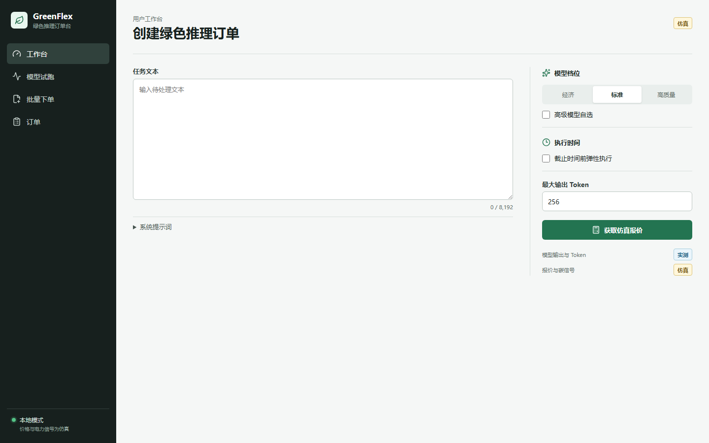

# GreenFlex

GreenFlex 是面向用户的本地绿色文本推理订单平台。用户可以顺序对比本地开源模型、提交 CSV/JSONL 批量任务、选择立即或弹性执行，并获得 GreenBill 与不包含原文的 Token Passport。

> v0.1.0 是单租户、无登录、无支付的本地 MVP。API 默认只监听 `127.0.0.1`，不得直接暴露到公网。

English summary: GreenFlex is a local-first text inference ordering platform with measured model usage and GPU telemetry, simulated flexible pricing and energy signals, and an auditable content-free Token Passport.



移动端布局见 [docs/images/workspace-mobile.png](docs/images/workspace-mobile.png)。截图由 Playwright 使用纯空白夹具生成，不包含用户数据或真实遥测。

## Product workflow

1. 在工作台输入单条文本，选择经济、标准或高质量档位并获取报价。
2. 在模型试跑页顺序比较已安装模型的输出、Token、延迟与 GPU 能耗。
3. 上传 UTF-8 CSV/JSONL 批量任务，选择立即或截止时间前弹性执行。
4. 查看订单逐项结果、实际仿真账单、能源记录并下载结果。
5. 查看 Token Passport 的输入/输出哈希、模型、用量、能耗、碳排和声明边界。

## Data truth boundary

- **Measured:** local model output, token counts, latency, and NVIDIA GPU board power when telemetry is available.
- **Estimated:** facility energy derived from measured GPU energy and an explicitly versioned PUE assumption.
- **Simulated:** electricity price, grid carbon intensity, renewable share, service prices, discounts, and green grades.

GreenFlex does not claim zero-carbon inference, government certification, or provider-side cloud energy measurement.

### Three-tier energy data provenance (v2)

GreenRouter v2 labels every model's energy data with a confidence tier.
Only L1-L3 tiers with defensible, auditable data are used for scoring.
L4 analytical models and L5 FLOPs estimates are intentionally excluded.

| Tier | Source | Confidence | Scoring penalty |
|------|--------|------------|-----------------|
| L1 | Local NVML measurement | 95% | 1.00x |
| L2 | Exact model+GPU benchmark match | 85% | 1.05x |
| L3 | Cross-GPU normalized benchmark | 65% | 1.15x |
| — | Insufficient data (not scored) | 0% | 10.0x |

Models without L1-L3 data are marked "数据不足" and receive maximum penalty,
effectively excluding them from energy-aware recommendation when alternatives
exist. L1 is always available for any model measured locally.

Built-in benchmark data: 18 curated entries from JouleBench (12 models on
A100), arXiv 2608.00008 (Qwen2.5 on RTX 4060 Ti), and Watt Counts (70B+
models on H100). Import more via `scripts/import_benchmarks.py`.

### Real-time grid carbon intensity (v2)

Carbon intensity is fetched from a multi-backend provider chain:

1. **Electricity Maps API** — global real-time (free tier, API key required)
2. **DynLCA China regional data** — 31 provinces with TOU variation (no key)
3. **Synthetic fallback** — always available, clearly labeled SIMULATED

Results are cached for 15 minutes. Every response includes `provenance` so
the UI can distinguish real-time API data from simulated estimates.

### Reinforcement learning router (v2, optional)

GreenFlex includes a lightweight PPO (Proximal Policy Optimization) router that
learns optimal model selection from historical order data.

- **Modes**: disabled → shadow (observe) → advisory (suggest) → autonomous
- **Shadow mode by default**: RL observes and logs, never overrides rule-based
- **Multi-objective reward**: quality 35%, price 20%, energy 15%, carbon 10%,
  latency 10%, wait 5%, renewable 5%
- **Pure numpy**: no PyTorch/TensorFlow dependency, suitable for local use
- **Auditable**: every decision logged with state, action, reward, policy version

API: `GET /api/v1/rl/status`, `POST /api/v1/rl/train`, `POST /api/v1/rl/mode`

### C2PA-compatible Token Passport (v2)

Token Passports include C2PA 1.3-compatible manifests with standard and
GreenFlex custom assertions:

- `c2pa.actions` — AI generation action with software agent info
- `c2pa.creative-work` — content type and description
- `greenflex.model_usage` — model ID, token counts, latency, content hashes
- `greenflex.energy_usage` — energy, carbon, provenance tier
- `greenflex.provenance` — passport metadata, data truth boundary

Signed with HMAC-SHA256 (local-first). Contains content hashes only, never raw
prompts or outputs.

API: `GET /api/v1/passports/{id}/c2pa`, `POST /api/v1/c2pa/verify`

### EU AI Act compliance reporting (v2)

Generate compliance reports aligned with EU AI Act (Regulation (EU) 2024/1689):

- **Article 50**: AI content transparency (C2PA Token Passport)
- **Article 53**: GPAI obligations — technical docs, training data, copyright,
  **energy consumption reporting** (GreenFlex strength)
- **Articles 10-15**: High-risk system obligations (data governance, record-
  keeping, human oversight, accuracy/robustness/security)

Outputs JSON and Markdown. Includes compliance score, evidence, and actionable
recommendations.

API: `GET /api/v1/compliance/ai-act`, `GET /api/v1/compliance/ai-act/{model_id}`

## Architecture

```text
React Web -> FastAPI API -> SQLite WAL <- Persistent Worker
                                         |-> Ollama + Qwen2.5
                                         `-> NVIDIA nvidia-smi telemetry
```

领域端口固定为 `InferenceProvider`、`TelemetryProvider`、`EnergySignalProvider`、`SchedulingPolicy`、`PricingPolicy`、`BillingPolicy` 和 `PassportIssuer`。

## Quick start

Prerequisites: Windows 10+, Python 3.13, uv, Node.js 24, pnpm 11, NVIDIA driver, and Ollama.

```powershell
powershell -NoProfile -ExecutionPolicy Bypass -File .\scripts\bootstrap.ps1
powershell -NoProfile -ExecutionPolicy Bypass -File .\scripts\install-models.ps1
powershell -NoProfile -ExecutionPolicy Bypass -File .\scripts\hardware-smoke.ps1
powershell -NoProfile -ExecutionPolicy Bypass -File .\scripts\dev.ps1
```

模型默认下载到 `D:\GreenFlex\models`，不进入仓库。启动后访问 `http://127.0.0.1:5173`，API 文档位于 `http://127.0.0.1:8000/docs`。

## Local stack

- React + TypeScript user application
- FastAPI modular monolith and persistent worker
- SQLite with Alembic migrations
- Ollama with Qwen2.5 0.5B, 1.5B, and 3B models
- NVIDIA telemetry through `nvidia-smi`

## Input contract

CSV 列或 JSONL 对象字段：

```json
{
  "client_item_id": "item-001",
  "prompt": "text to process",
  "system_prompt": null,
  "max_output_tokens": 256
}
```

文件必须为 UTF-8，最大 5MB、500 条；单条提示词最大 8192 字符，输出限制 16-512 Token。

## Quality gates

```powershell
powershell -NoProfile -ExecutionPolicy Bypass -File .\scripts\check.ps1
```

该命令执行 Ruff、mypy、pytest、pip-audit、ESLint、TypeScript、Vitest、构建、Playwright 和 pnpm audit。后端及前端核心代码行覆盖率均不低于 80%。

发布前使用 `scripts/generate-release.ps1` 生成 CycloneDX SBOM、依赖/许可证清单和 SHA-256 校验文件；生成物位于已忽略的 `release/` 目录，仅作为 GitHub Release 附件。

## Security boundary

- 不记录提示词、输出、密钥、Cookie 或 Authorization 头。
- `.env`、数据库、上传、结果、遥测、日志与模型权重均被 Git 忽略。
- 云端密钥只能由后端环境变量读取；禁止把秘密写入 `VITE_*`。
- Passport 只保存不可逆内容哈希、统计、决策、账单与来源。
- 内容清除会删除提示词、输出和原始遥测工件，保留匿名聚合与审计哈希。
- 模型不可用时明确降级，不自动升级到更贵模型。

See [ARCHITECTURE.md](ARCHITECTURE.md), [SECURITY.md](SECURITY.md), [docs/threat-model.md](docs/threat-model.md), and [docs/development-standards.md](docs/development-standards.md) before contributing.

## License

Source code is licensed under Apache-2.0. Model weights, datasets, and third-party components retain their own licenses and are not redistributed by this repository.
