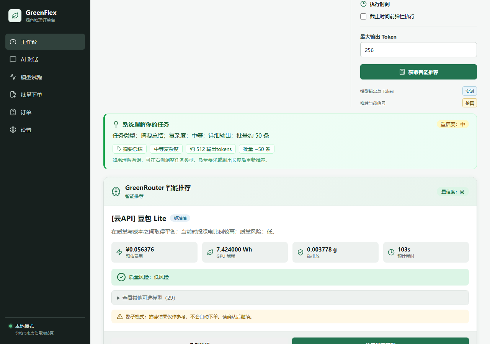
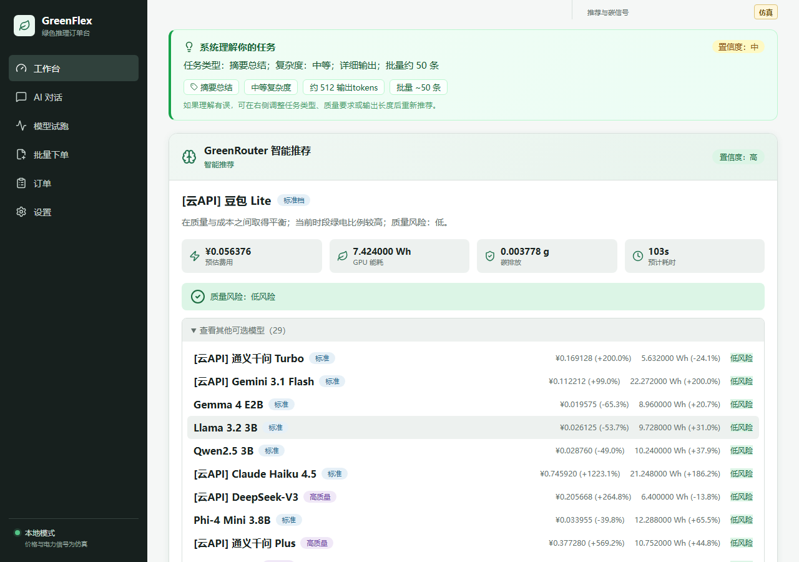
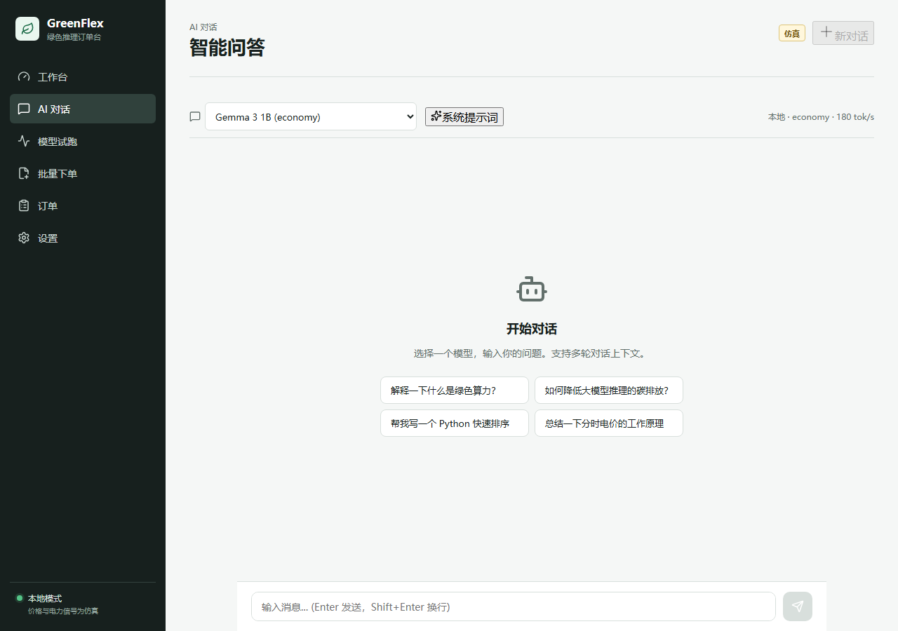
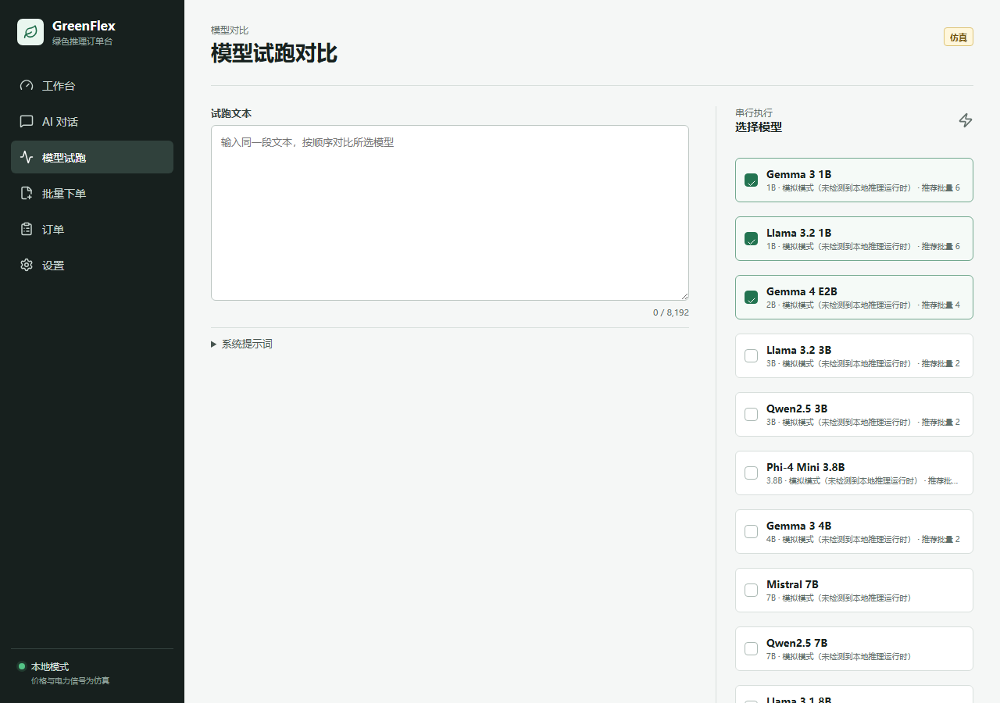
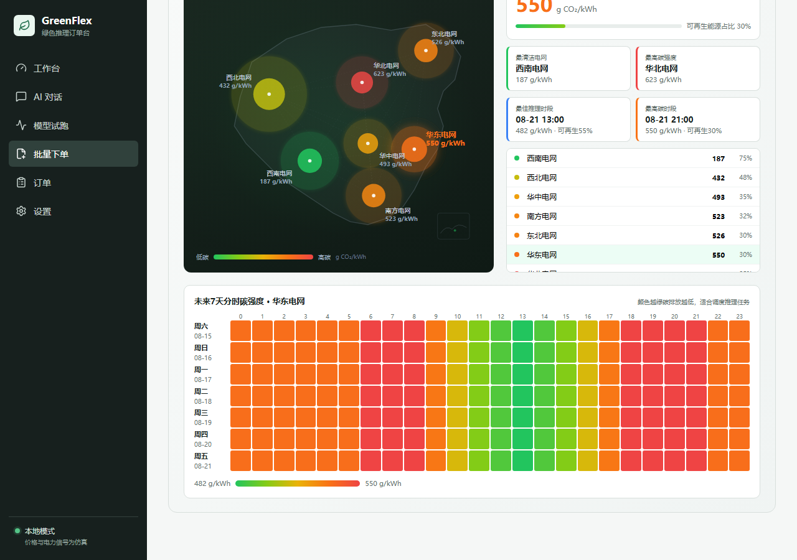
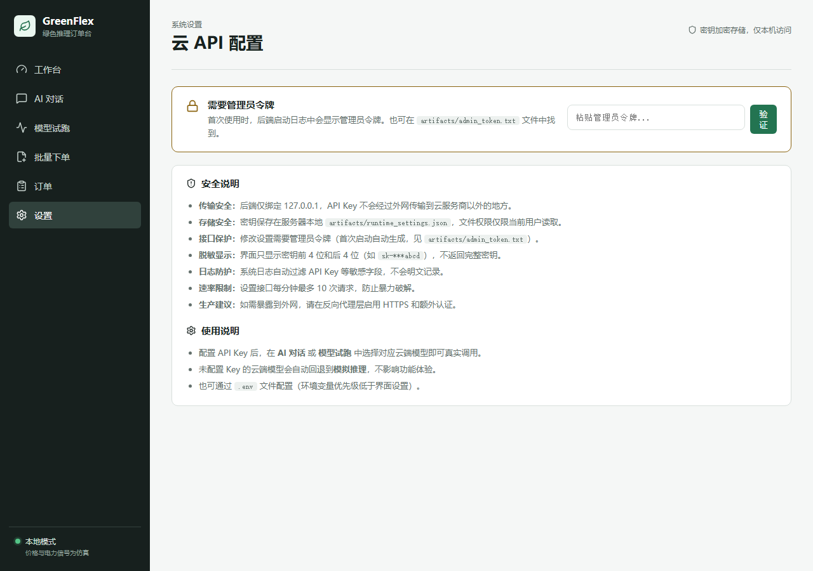

# GreenFlex 绿色推理路由平台 — 项目介绍与使用教程

> 让每次 AI 推理都选择最合适的模型，在质量、成本和碳排放之间找到最优解。

---

## 一、这是什么？

GreenFlex 是一个**绿色 AI 推理调度平台**。简单说，它帮你回答一个问题：

> "我这个任务，该用哪个 AI 模型最划算、最省电、最环保？"

大模型有几十种，有的又快又便宜（适合简单分类），有的又慢又贵（适合写代码、做分析）。如果你用 GPT-4 去做"判断好评差评"这种简单任务，就像用大卡车送快递——浪费钱、浪费电、多排碳。

GreenFlex 做三件事：

1. **读懂你的任务** — 你用大白话描述需求，它自动判断任务类型、复杂度、输出长度
2. **推荐最合适的模型** — 在 35 个模型（15 个本地开源 + 20 个云端 API）中选性价比最高的
3. **追踪碳排放** — 基于中国七大电网的实时碳强度数据，告诉你什么时候推理最环保

### 核心特性

| 特性 | 说明 |
|------|------|
| 自然语言任务理解 | 不用填 token 数，说"帮我整理一批反馈"就行 |
| 35 个模型可选 | 0.5B 到 70B 本地模型 + GPT-4o/Claude/DeepSeek 等 20 个云端模型 |
| 智能推荐 | 综合质量、价格、能耗、碳排、延迟多目标打分 |
| 模型横向对比 | 同一段文本同时跑多个模型，直观对比效果和能耗 |
| 中国电网碳地图 | 七大区域实时碳强度可视化，支持分时调度 |
| 云 API 即插即用 | 填入 OpenAI/Anthropic/DeepSeek/阿里/字节/Google 的 Key 即可调用 |
| 零依赖启动 | 不需要 GPU、不需要装 Ollama，模拟模式开箱即用 |

---

## 二、快速开始

### 环境要求

- Python 3.12+
- Node.js 18+
- 不需要 GPU，不需要安装 Ollama

### 启动后端

```bash
cd backend
python -m venv .venv
.venv\Scripts\activate          # Windows
# source .venv/bin/activate     # Linux/Mac
pip install -e ".[dev]"
python -m greenflex.seed_catalog   # 初始化模型数据库（首次）

$env:PYTHONPATH="src"               # Windows PowerShell
# export PYTHONPATH=src            # Linux/Mac
python -m uvicorn greenflex.api:app --host 127.0.0.1 --port 8000
```

后端启动后，API 文档在 http://127.0.0.1:8000/docs

### 启动前端

```bash
cd apps/web
npm install
npx vite --host 127.0.0.1 --port 5173
```

打开浏览器访问 **http://127.0.0.1:5173**

> 左下角显示"本地模式"表示当前使用模拟推理，不需要任何外部依赖即可体验全部功能。配置云 API Key 后会自动切换为真实调用。

---

## 三、功能教程

### 3.1 工作台 — 智能推荐模型

工作台是最常用的页面。你只需要用自然语言描述任务，系统会自动理解并推荐模型。


**使用步骤：**

1. 在"任务文本"框里输入你的任务（大白话就行）
2. 右侧选择路由模式（一般用"智能"即可）
3. 点击"获取智能推荐"

**示例：** 输入"帮我把最近收集的一批客户反馈整理一下，看看主要问题集中在哪些方面，最好能分个类，给我一份总结报告"

系统会自动识别出：



绿色卡片"系统理解你的任务"展示了 AI 对你需求的理解：

- **任务类型**：摘要总结
- **复杂度**：中等
- **输出长度**：详细输出（约 512 tokens）
- **批量规模**：约 50 条（因为你说了"一批"）
- **置信度**：中

下面的推荐卡片给出了具体模型和费用估算：

- 推荐模型：豆包 Lite（标准档）
- 预估费用：¥0.056（50 条数据）
- GPU 能耗：7.42 Wh
- 碳排放：0.0038 g
- 预计耗时：103 秒

点击"查看其他可选模型"可以展开 29 个备选模型的价格和能耗对比：



> **如果理解有误**：可以在右侧"任务类型"下拉框手动选择，或调整质量要求后重新推荐。

**四种路由模式：**

| 模式 | 适用场景 |
|------|---------|
| 智能 | 自动平衡质量、成本和能耗（推荐） |
| 经济 | 优先选最便宜、最省电的模型 |
| 高质量 | 优先保证输出质量 |
| 手动 | 自己选模型档位或指定具体模型 |

---

### 3.2 AI 对话 — 和模型直接聊天

AI 对话页面让你直接和任意模型对话，适合快速测试模型效果。



**使用步骤：**

1. 顶部下拉框选择模型（30 个可选，分类器模型已自动隐藏）
2. 在底部输入框输入问题，按 Enter 发送
3. 也可以点击快捷问题按钮快速体验


每条回复下方显示绿色指标条：

- **Token 数**：输入 15 + 输出 8
- **耗时**：106 ms
- **费用**：¥0.000001
- **能耗**：0.0014 Wh
- **碳排**：0.0008 g

支持多轮对话上下文、系统提示词、新对话/清空对话。

> 未配置云 API Key 时，云端模型返回模拟输出；配置 Key 后自动切换为真实调用。

---

### 3.3 模型试跑 — 多个模型横向对比

想知道同一段文本用不同模型跑出来有什么区别？用模型试跑。



**使用步骤：**

1. 输入同一段文本
2. 在右侧勾选想对比的模型（默认选了 3 个小模型，最多可选多个）
3. 点击底部"运行 N 个模型"
4. 等待顺序执行完成


每个模型一张卡片，并排对比：

| 模型 | 延迟 | GPU 能耗 | 能效 |
|------|------|---------|------|
| Gemma 3 1B | 119 ms | 0.000395 Wh | 0.1778 J/tok |
| Llama 3.2 1B | 119 ms | 0.000397 Wh | 0.1786 J/tok |
| Gemma 4 E2B | 220 ms | 0.000686 Wh | 0.3087 J/tok |

可以直观看出：1B 模型速度快一倍、能耗低 40%，适合简单任务。

---

### 3.4 批量下单 — 碳地图与分时调度

批量处理大量任务时，可以选择"弹性执行"——让系统等到电网碳强度最低的时段再跑，既环保又省钱。


**中国七大电网区域碳强度地图：**

- 颜色越绿 = 碳强度越低（西南水电多，最清洁）
- 颜色越红 = 碳强度越高（华北火电多，最高碳）
- 点击任意区域，下方热图切换到该区域数据

右侧统计面板显示：

- 当前区域碳强度大数字
- 可再生能源占比进度条
- 最清洁电网 / 最高碳电网
- 最佳推理时段 / 最高碳时段预警
- 七大区域排序列表（点击可切换）



下方是 7 天 × 24 小时碳强度热图：

- **绿色格子** = 低碳时段（适合跑推理）
- **红色格子** = 高碳时段（建议避开）
- 每天中午 11-15 点光伏大发，碳强度明显下降
- 夜间风电出力，部分区域也较绿

**七大电网碳强度参考值：**

| 区域 | 碳强度 (g CO₂/kWh) | 可再生占比 |
|------|-------------------|-----------|
| 西南电网 | 187 | 75% |
| 西北电网 | 432 | 48% |
| 华中电网 | 493 | 35% |
| 南方电网 | 523 | 32% |
| 东北电网 | 526 | 30% |
| 华东电网 | 550 | 30% |
| 华北电网 | 623 | 25% |

---

### 3.5 订单管理

在"订单"页面查看所有推理订单的状态、费用和结果。


---

### 3.6 设置 — 配置云 API Key

要让云端模型（GPT-4o、Claude、DeepSeek 等）真正工作，需要配置 API Key。

首次打开设置页需要输入管理员令牌：



令牌在后端首次启动时自动生成，位于 `backend/artifacts/admin_token.txt` 文件中。验证通过后即可看到 6 家服务商的配置界面：


**支持 6 家服务商：**

| 服务商 | 获取地址 | 代表模型 |
|--------|---------|---------|
| OpenAI | https://platform.openai.com/api-keys | GPT-4o, GPT-4o Mini |
| Anthropic | https://console.anthropic.com/ | Claude Opus 4.6, Sonnet 4.6, Haiku 4.5 |
| DeepSeek | https://platform.deepseek.com/ | DeepSeek-V3, DeepSeek-R1 |
| 阿里云百炼 | https://help.aliyun.com/zh/model-studio/ | 通义千问 Max/Plus/Turbo |
| 火山引擎方舟 | https://www.volcengine.com/product/doubao | 豆包 Pro 1.5, 豆包 Lite |
| Google AI | https://aistudio.google.com/apikey | Gemini 3.1 Pro/Flash |

**配置步骤：**

1. 首次打开设置页，需要输入管理员令牌（在 `backend/artifacts/admin_token.txt` 文件中）
2. 在对应服务商的输入框粘贴 API Key
3. 点击"保存"
4. 保存后只显示掩码（如 `sk-t***cdef`），不返回完整密钥

**安全措施：**

- 密钥仅存储在本地 `artifacts/runtime_settings.json`，不外传
- 文件权限仅限当前用户读取
- 所有接口绑定 127.0.0.1，不对外暴露
- 日志自动脱敏，不会记录完整密钥
- 写入接口有速率限制（10 次/分钟）
- 未配置 Key 的云端模型自动回退到模拟模式，不影响体验

---

## 四、API 使用示例

后端提供完整的 REST API，所有接口都在 http://127.0.0.1:8000/docs 有交互式文档。

### 4.1 获取模型列表

```bash
curl http://127.0.0.1:8000/api/v1/models
```

返回 35 个模型，每个包含：档位、参数量、上下文长度、价格、能耗、是否启用、官方数据来源等。

### 4.2 智能推荐

```bash
curl -X POST http://127.0.0.1:8000/api/v1/recommendations \
  -H "Content-Type: application/json" \
  -d '{
    "mode": "smart",
    "task_type": "auto",
    "prompt_preview": "帮我写一个Python快速排序",
    "quality_requirement": "standard"
  }'
```

实际返回（已验证）：

```json
{
  "recommended_model_name": "[云API] 通义千问 Turbo",
  "recommended_tier": "balanced",
  "estimated_price_rmb": "0.001934",
  "estimated_energy_wh": "0.056320",
  "estimated_carbon_g": "0.000028",
  "reason_summary": "在质量与成本之间取得平衡；当前时段绿电比例较高；质量风险：低。",
  "task_understanding": {
    "task_type_label": "内容生成",
    "complexity_label": "简单",
    "estimated_output_tokens": 128,
    "reasoning": "任务类型：内容生成；复杂度：简单；中等输出",
    "confidence_label": "中"
  }
}
```

### 4.3 AI 对话

```bash
curl -X POST http://127.0.0.1:8000/api/v1/chat \
  -H "Content-Type: application/json" \
  -d '{
    "model_id": "gemma3-1b-q4",
    "messages": [{"role": "user", "content": "你好，什么是绿色算力？"}]
  }'
```

实际返回：

```json
{
  "model_name": "Gemma 3 1B",
  "reply": "任务类型: 通用\n[模拟输出] 经济档模型 (hash:7eca689f0d33)",
  "prompt_tokens": 1,
  "completion_tokens": 8,
  "duration_ms": 112,
  "estimated_price_micro_rmb": 1,
  "estimated_energy_micro_wh": 1440,
  "inference_source": "hybrid"
}
```

### 4.4 查询碳信号

```bash
# 七大电网区域
curl http://127.0.0.1:8000/api/v1/signals/regions

# 某区域 7 天分时碳强度
curl "http://127.0.0.1:8000/api/v1/signals/calendar?region=CN-Southwest&days=7"
```

### 4.5 模型试跑

```bash
curl -X POST http://127.0.0.1:8000/api/v1/previews \
  -H "Content-Type: application/json" \
  -d '{
    "model_id": "gemma3-1b-q4",
    "prompt": "用一句话解释机器学习",
    "max_output_tokens": 128
  }'
```

---

## 五、任务理解能力说明

系统内置了规则任务分类器（TaskClassifier v2），能从自然语言中自动推断：

| 推断项 | 示例触发词 | 推断结果 |
|--------|-----------|---------|
| 任务类型 | "分类""判断""情感" | 分类判断 |
| | "提取""关键词""实体" | 信息抽取 |
| | "总结""摘要""整理""报告" | 摘要总结 |
| | "分析""评估""对比""解释" | 分析推理 |
| | "写""生成""创作""文案" | 内容生成 |
| | "代码""函数""bug""算法" | 代码编程 |
| | "翻译""英文""中文" | 翻译 |
| 输出长度 | "一句话""简短""几个字" | 简短（~32 tokens） |
| | "详细""全面""方案""文档" | 详细（~512 tokens） |
| 批量规模 | "一批""大量""批量" | ~50 条 |
| | "几十""多个""多条" | ~10 条 |
| | "100条""50个" | 精确数量 |
| 复合任务 | "整理...分类...总结" | 识别多个意图，取主任务 |

未来版本将接入 Qwen2.5 小模型做更精准的语义分类。

---

## 六、模型档位说明

| 档位 | 代表模型 | 适用场景 | 价格区间 |
|------|---------|---------|---------|
| 经济档 (economy) | Gemma 3 1B, Gemini Flash Lite | 简单分类、情感判断、关键词提取 | 最低 |
| 标准档 (balanced) | 通义千问 Turbo, 豆包 Lite, Llama 3.2 3B | 日常对话、摘要、翻译、简单分析 | 低 |
| 高质量档 (quality) | DeepSeek-V3, GPT-4o, Gemma 3 4B | 代码编写、复杂分析、内容创作 | 中 |
| 企业档 (enterprise) | GPT-5 Pro, Claude Opus 4.6, 豆包 Pro 1.5 | 关键任务、复杂推理、高精度要求 | 高 |

---

## 七、常见问题

**Q: 不装 Ollama、没有 GPU 能用吗？**
A: 可以。默认使用模拟推理模式，所有功能都能正常体验。配置云 API Key 后可以调用真实模型。

**Q: 模拟模式和真实调用有什么区别？**
A: 模拟模式返回占位文本（基于输入 hash 生成），但 token 数、延迟、费用、能耗都是按真实模型参数估算的，适合测试流程和界面。配置 Key 后自动切换为真实模型输出。

**Q: API Key 安全吗？**
A: Key 只存在你本地的 `artifacts/runtime_settings.json` 文件中，后端只绑定 127.0.0.1，不会把 Key 发送给除对应服务商以外的任何地方。界面只显示掩码，日志自动脱敏。

**Q: 碳排放数据是真实的吗？**
A: 七大电网区域的年度基准碳强度来自公开电力数据，分时波动为模拟数据（基于光伏发电昼高夜低、风电夜间出力等典型模式）。未来可接入真实电力碳排放 API。

**Q: 模型的能耗和价格数据来源？**
A: 每个模型都标注了官方来源，包括 OpenAI/Anthropic/Google 官方定价页、DeepSeek/Qwen 技术报告（arXiv）、JouleBench 实测基准、Watt Counts 能耗估算等。在模型列表的 `official_data_source` 字段可查。

**Q: 如何接入自己的本地模型？**
A: 系统预留了 Ollama 接口，安装 Ollama 并拉取对应模型后，将 `container.py` 中的 `SimulatedInferenceProvider` 切换为 `OllamaInferenceProvider` 即可。

---

## 八、项目结构

```
GreenFlex/
├── backend/
│   ├── src/greenflex/
│   │   ├── api.py              # FastAPI 入口
│   │   ├── services.py         # 业务逻辑
│   │   ├── recommendation.py   # GreenRouter 多目标推荐策略
│   │   ├── task_classifier.py  # 自然语言任务理解
│   │   ├── simulated_provider.py # 模拟推理
│   │   ├── cloud_provider.py   # 6 家云 API 骨架
│   │   ├── hybrid_provider.py  # 云端/模拟混合路由
│   │   ├── agent_integration.py # 外部 Agent 接入
│   │   ├── catalog.py          # 35 个模型目录
│   │   ├── models.py           # 数据库模型
│   │   ├── schemas.py          # API 数据结构
│   │   └── security.py         # 鉴权与安全
│   └── tests/                  # 184 项测试
├── apps/web/
│   └── src/
│       ├── pages/              # 6 个页面
│       ├── components/         # 组件（含碳地图）
│       └── api/client.ts       # API 客户端
└── docs/
    └── images/                 # 本文档截图
```

---

*本文档所有示例均在 2026-08-15 实际运行验证通过。*
