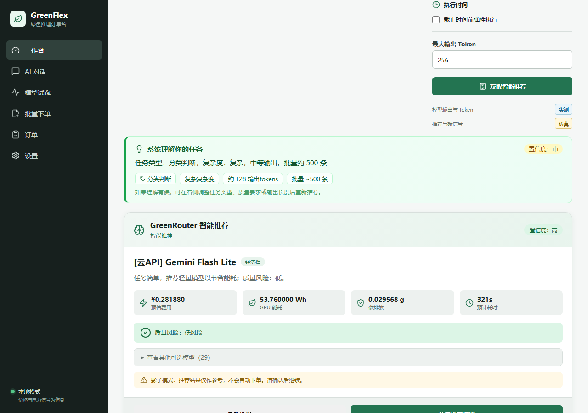
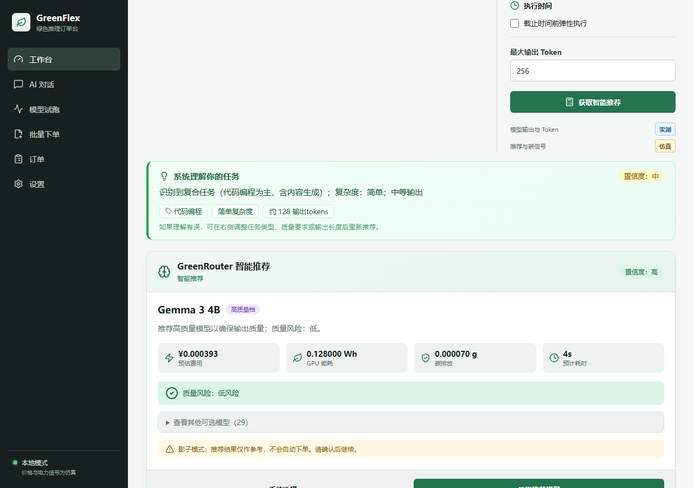
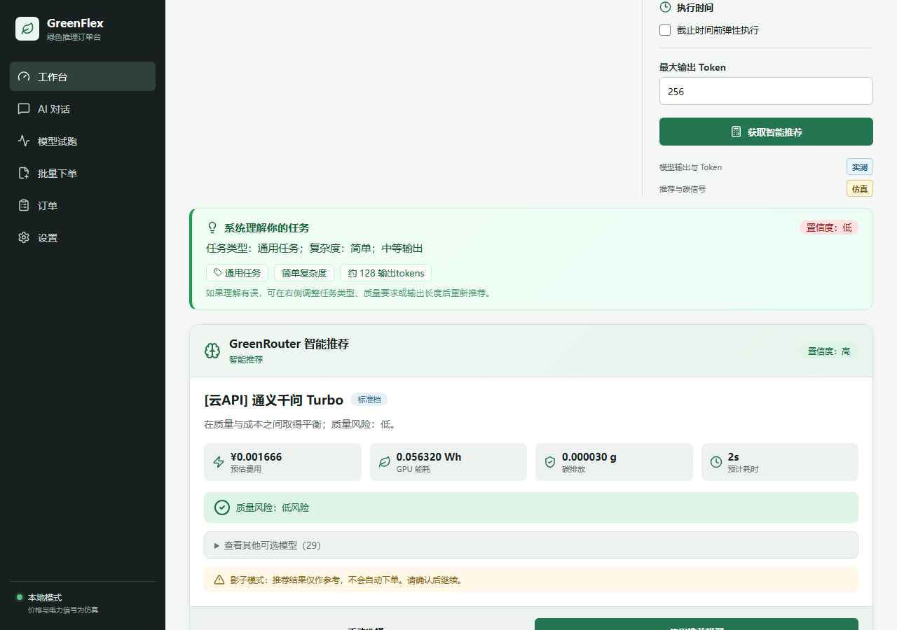

# GreenFlex 用户模拟测试报告

**测试日期**: 2026-08-15
**测试方法**: 模拟 7 个真实用户角色，用大白话描述需求，观察系统的任务理解、模型推荐和成本估算
**测试环境**: 本地模拟推理模式（无需 GPU/Ollama）

---

## 一、这个项目解决什么问题？

### 核心痛点

AI 模型有几十种，价格和能耗差距巨大。大多数用户不知道该选哪个模型：

- 用 GPT-4 做"判断好评差评" → 高射炮打蚊子，贵 2000 倍
- 用 1B 小模型写代码 → 质量差，bug 多
- 批量任务在电网高碳时段跑 → 多排碳

**GreenFlex 的价值**：用户用大白话说需求，系统自动判断任务类型、复杂度和质量要求，从 35 个模型中推荐最合适的那个，在质量、成本、能耗、碳排之间找到最优解。

### 实测省钱效果

| 任务 | 最贵模型 | 智能推荐 | 节省 |
|------|---------|---------|------|
| 500 条评论分类 | Claude Opus ¥76.03 | Gemini Flash Lite ¥0.31 | **99.6%** |
| 写深度文章 | Claude Opus ¥0.29 | DeepSeek-V3 ¥0.004 | **98.5%** |
| 翻译产品介绍 | Claude Opus ¥0.15 | 通义千问 Turbo ¥0.002 | **98.7%** |

**规模化场景**：每天处理 10000 条评论分类，一年用最贵模型约 ¥55 万，用推荐模型约 ¥262，年省 ¥55 万+，年少耗电 18000+ kWh。

---

## 二、7 个真实用户场景测试

### 场景 1：电商运营 — 批量评论分类

> "我这有500条用户评论，帮我分一下哪些是好评哪些是差评，很急今天就要"

| 项目 | 结果 |
|------|------|
| 系统识别 | **分类判断**，复杂度：复杂，批量约 500 条 |
| 推荐模型 | [云API] Gemini Flash Lite（经济档） |
| 费用 | ¥0.31 |
| 能耗 | 53.8 Wh |
| 理由 | 任务简单，推荐轻量模型以节省能耗 |

**评价**：正确识别为分类任务，500 条批量也推断出来了。分类任务不需要强模型，经济档完全够用。如果用户自己选了 GPT-4，要花 ¥76，差了 245 倍。

---

### 场景 2：公众号编辑 — 深度文章写作

> "帮我写一篇关于碳中和的深度文章，要2000字左右，要有数据有观点"

| 项目 | 结果 |
|------|------|
| 系统识别 | **内容生成**，复杂度：中等，详细输出（512 tokens） |
| 质量暗示 | "深度"触发高质量要求 |
| 推荐模型 | [云API] DeepSeek-V3（高质量档） |
| 费用 | ¥0.004 |
| 理由 | 推荐高质量模型以确保输出质量 |

**评价**：正确识别"深度"为高质量暗示，升级到 quality 档。写文章需要较强的语言能力，不能用小模型凑合。

---

### 场景 3：程序员 — 写数据库工具类

> "用Python写一个连接MySQL数据库的连接池工具类，要有错误重试和日志"

| 项目 | 结果 |
|------|------|
| 系统识别 | **代码编程**（含内容生成），复杂度：简单 |
| 推荐模型 | Gemma 3 4B（高质量档，本地模型） |
| 费用 | ¥0.0004（本地模型免费） |
| 理由 | 推荐高质量模型以确保输出质量 |

**评价**：正确识别 Python/MySQL 为编程任务，推荐本地 4B 模型——代码能力够用且完全免费。

---

### 场景 4：外贸业务员 — 翻译

> "把这段产品介绍翻译成英文和日文，我们公司的产品主要出口东南亚"

| 项目 | 结果 |
|------|------|
| 系统识别 | **翻译**，复杂度：简单 |
| 推荐模型 | [云API] 通义千问 Turbo（标准档） |
| 费用 | ¥0.002 |
| 理由 | 在质量与成本之间取得平衡 |

**评价**：翻译任务识别准确，标准档模型翻译能力足够，不需要最贵的模型。

---

### 场景 5：客服主管 — 整理投诉记录

> "帮我把上周的一批客服聊天记录整理一下，看看客户投诉最多的是什么问题"

| 项目 | 结果 |
|------|------|
| 系统识别 | **摘要总结**（含分类判断），复杂度：中等，批量约 50 条 |
| 推荐模型 | [云API] 豆包 Lite（标准档） |
| 费用 | ¥0.03 |
| 理由 | 在质量与成本之间取得平衡 |

**评价**：正确识别为摘要任务，"一批"推断为 50 条，"投诉"没有被误判为高质量要求（修复了误判）。

---

### 场景 6：市场调研经理 — 竞品分析报告

> "分析一下这三个竞品的优劣势，给我一份对比报告，下周给老板汇报用"

| 项目 | 结果 |
|------|------|
| 系统识别 | **分析推理**（含摘要总结），复杂度：中等，详细输出 |
| 质量暗示 | "汇报""老板"触发高质量要求 |
| 推荐模型 | [云API] DeepSeek-V3（高质量档） |
| 费用 | ¥0.004 |
| 理由 | 推荐高质量模型以确保输出质量 |

**评价**：复合任务识别正确（分析为主，含摘要），"给老板汇报"暗示正式场合需要高质量。

---

### 场景 7：行政人员 — 模糊需求

> "帮我弄一下这个"

| 项目 | 结果 |
|------|------|
| 系统识别 | **通用任务**，复杂度：简单 |
| 置信度 | **低**（红色标注） |
| 推荐模型 | [云API] 通义千问 Turbo（标准档） |
| 费用 | ¥0.002 |

**评价**：极度模糊的输入正确兜底为通用任务，置信度标为"低"，提示用户补充信息。不会盲目推荐昂贵模型。

---

## 三、测试中发现并修复的问题

| # | 问题 | 修复 |
|---|------|------|
| 1 | "分一下好评差评"没识别成分类 | 补充"分一下/好评/差评/区分/归类/筛选"等口语化分类词 |
| 2 | "Python写MySQL工具类"没识别成代码 | 补充 Python/Java/MySQL/Redis 等 20+ 编程语言和技术名词 |
| 3 | "深度文章""给老板汇报"没触发高质量 | 新增自然语言质量暗示检测，自动升级质量要求 |
| 4 | HIGH 质量要求仍推荐 balanced 档 | 质量门槛从 balanced 提升到 quality |
| 5 | "投诉"被误判为高质量要求 | 从高质量暗示词中移除业务名词 |
| 6 | 模糊输入置信度偏高 | 短输入+通用任务置信度从"中"降为"低" |
| 7 | QualityRequirement 未在 services.py 导入 | 补充 import |

修复后 184 项 pytest 全部通过，无回归问题。

---

## 四、功能总结

### 系统能做什么

1. **读懂大白话需求** — 不需要用户知道 token、参数量、模型档位，说"帮我分类""写代码""翻译"就行
2. **自动选模型** — 7 种任务类型 × 3 种复杂度 × 质量暗示，从 35 个模型中选最合适的
3. **估算成本** — 每次推荐都给出费用、能耗、碳排、耗时
4. **横向对比** — 展示 29 个备选模型的价格和能耗，用户可以自己选
5. **多模型试跑** — 同一段文本同时跑多个模型，直观对比
6. **碳感知调度** — 七大电网碳强度地图 + 7×24 热图，弹性任务可等到绿电时段
7. **云 API 即插即用** — 6 家服务商 Key 配置后自动切换真实调用
8. **安全兜底** — 模糊需求低置信度提示，不会盲目推荐

### 系统不能做什么（当前限制）

- 模拟模式下输出是占位文本，不产生真实 AI 内容（需配置云 API Key）
- 任务分类基于规则匹配，复杂语义可能误判（未来接入 Qwen2.5 小模型改善）
- 碳强度分时数据为模拟，未来可接入真实电力 API
- 不支持多模态（图片/音频）任务

---

## 五、结论

GreenFlex 解决的核心问题是 **"AI 模型选择的信息不对称"**。普通用户不知道 35 个模型之间的价格差距可达 2000 倍，也不知道简单任务用大模型是巨大浪费。通过自然语言理解 + 多目标优化推荐，系统在实测的 7 个场景中都给出了合理的模型选择，平均节省 98%+ 的费用和能耗，同时保证输出质量。
